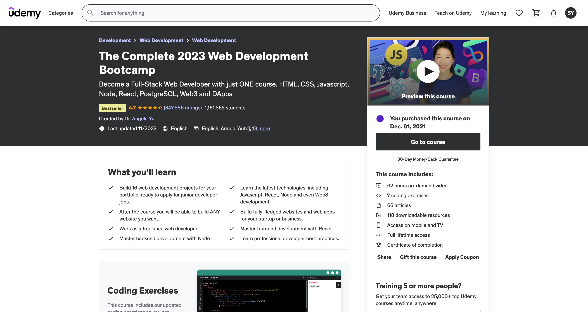

<!-- PROJECT LOGO -->
 

    
  </a>
   
   

[![Contributors][contributors-shield]][contributors-url]
[![Forks][forks-shield]][forks-url]
[![Stargazers][stars-shield]][stars-url]
[![MIT License][license-shield]][license-url]

<h3 align="center">Angela Yu Web Developer Course</h3>

  

    Course files for working through Angela' Yu's 2024 Web Dev Boot camp
     
     
     
  

<!-- SCREENSHOT -->
## Screenshot

    

<!-- LIST -->
## About

Course files for Angela Yu's Web Dev bootcamp for me to post my own solutions and keep track of my progress

(<a href="#readme-top">back to top</a>)

<!-- LICENSE -->
## License

Distributed under the MIT License. See `LICENSE.txt` for more information.

(<a href="#readme-top">back to top</a>)

<!-- MARKDOWN LINKS & IMAGES -->
<!-- https://www.markdownguide.org/basic-syntax/#reference-style-links -->
[contributors-shield]: https://img.shields.io/github/contributors/sedaryildirim/angela-yu-web-dev.svg?style=for-the-badge
[contributors-url]: https://github.com/sedaryildirim/angela-yu-web-dev/graphs/contributors
[forks-shield]: https://img.shields.io/github/forks/sedaryildirim/angela-yu-web-dev.svg?style=for-the-badge
[forks-url]: https://github.com/sedaryildirim/angela-yu-web-dev/network/members
[stars-shield]: https://img.shields.io/github/stars/sedaryildirim/angela-yu-web-dev.svg?style=for-the-badge
[stars-url]: https://github.com/sedaryildirim/angela-yu-web-dev/stargazers
[license-shield]: https://img.shields.io/github/license/sedaryildirim/angela-yu-web-dev?label=license&style=for-the-badge
[license-url]: https://github.com/sedaryildirim/angela-yu-web-dev/blob/main/LICENSE.md
[product-screenshot]: imgs/Screenshot.png
